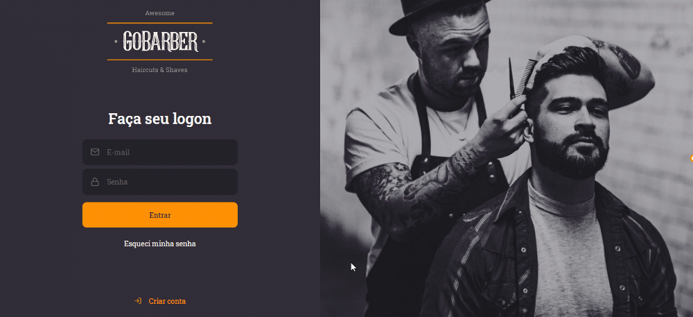

<h1 align="center">:rocket: GoBarber-Web :rocket:</h1>

<p align="center">

</p>

<p align="center">This project was developed in GoStack Bootcamp from Rocketseat. It is the frontend of an application for barbershops named GoBarber. The backend can be accessed <a href="https://github.com/yesminmarie/gobarber-backend">here</a> and the mobile version <a href="https://github.com/yesminmarie/gobarber-mobile">here</a>.</p>

<p align="center">
 <a href="#objective">Objective</a> •
 <a href="#technologies">Technologies</a> •
 <a href="#how-to-run">How to run the application</a> •
</p>

<h1 id="objective">:bulb: Objective</h1>
</p>This project is the frontend of the application named GoBarber. It allows the barber to view the list of the appointments of a particular day. This project was developed using React with Context API and Hooks.</p>

<h1 id="technologies">:rocket: Technologies</h1>

<p>It was used these technologies in this project.</p>

- [ReactJS](https://reactjs.org/ "ReactJS")
- [Typescript](https://www.typescriptlang.org/ "Typescript")
- [Styled Components](https://styled-components.com/ "Styled Components")
- [Polished](https://polished.js.org/ "Polished")
- [Date-fns](https://date-fns.org/ "Date-fns")
- [React-icons](https://react-icons.github.io/react-icons/ "React-icons")
- [React Router Dom](https://reactrouter.com/web/guides/quick-start "React Router Dom")
- [React-day-picker](https://react-day-picker.js.org/ "React-day-picker")
- [Unform](https://unform.dev/ "Unform")
- [Yup](https://github.com/jquense/yup "Yup")
- [Axios](https://github.com/axios/axios "Axios")
- [Node.js](https://nodejs.org/en/ "Node.js")
- [PostgreSQL](https://www.postgresql.org/)
- [Eslint](https://eslint.org/ "Eslint")
- [Prettier](https://prettier.io/ "Prettier")
- [EditorConfig](https://editorconfig.org/ "EditorConfig")

<h1 id="how-to-run">:computer: How to run the application</h1>

<h2>Pre Requiriments</h2>

<p>You will need these tools instaled in your machine:</p>

- [Node.js](https://nodejs.org/en/ "Node.js")
- [Yarn](https://yarnpkg.com/ "Yarn")
- [Git](https://git-scm.com/ "Git")

<p>And you will need to run the <a href="https://github.com/yesminmarie/gobarber-backend">API REST of GoBarber</a>:</p>

```bash
# Clone this repository
$ git clone https://github.com/yesminmarie/gobarber-web

# Go into the folder of the project
$ cd gobarber-web

# Install the dependencies
$ yarn

# Start the client
$ yarn start
```
<hr>

Made with :heart: by Yesmin Marie
